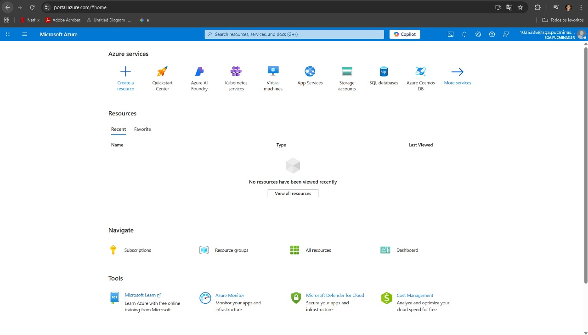
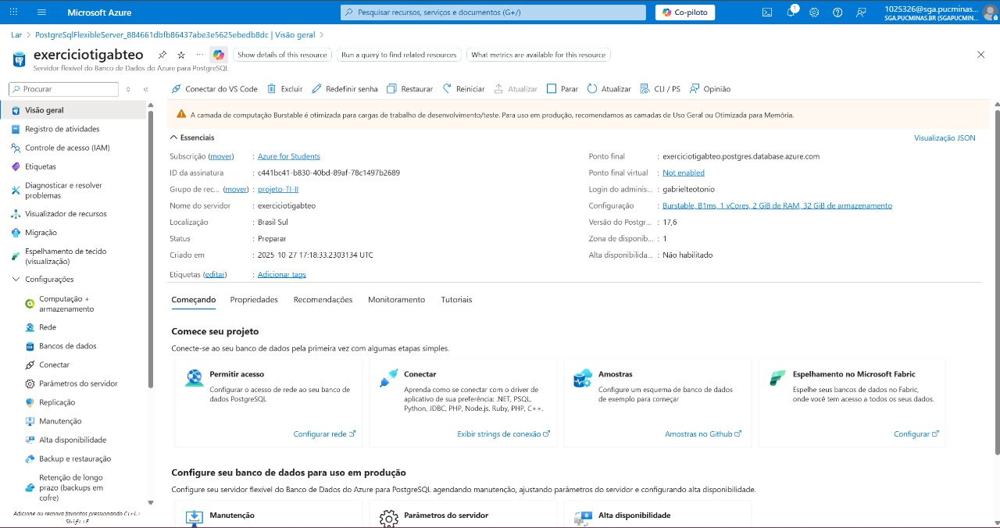
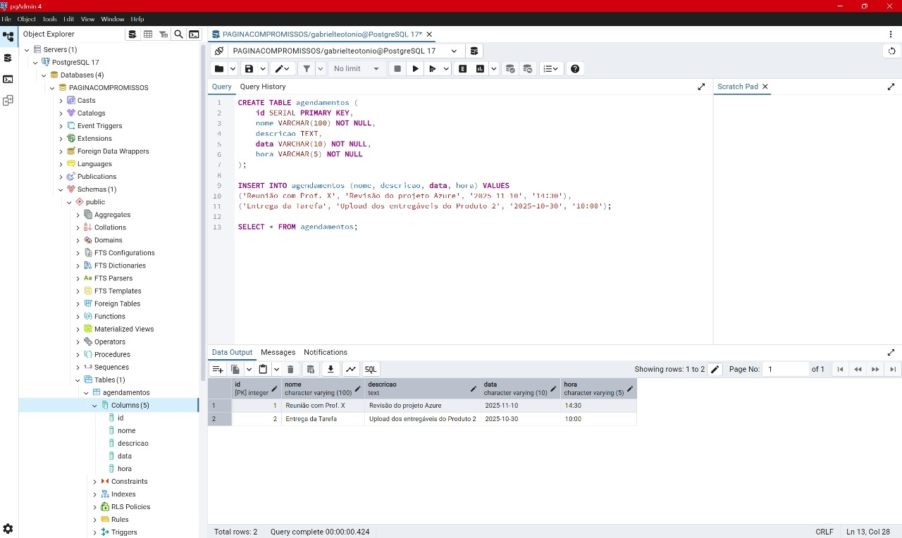
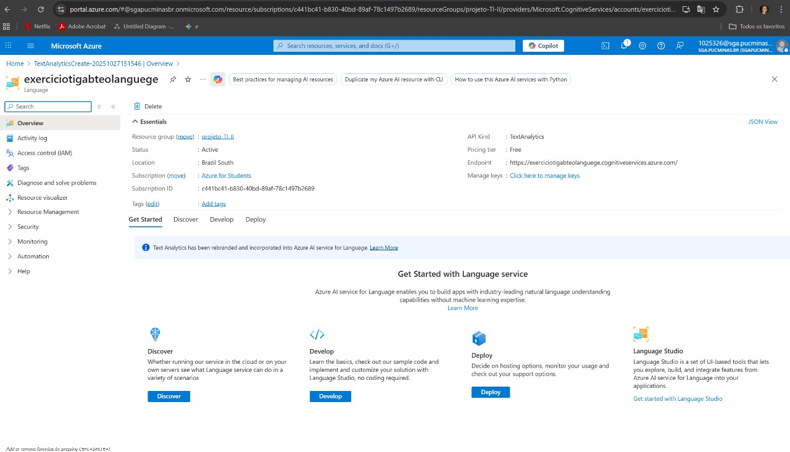

Nome: Gabriel Teotônio de Castro Coelho Costa
Matrícula: 885732

## Produto 1: Ativação da Conta Azure

## Produto 2: Banco de Dados PostgreSQL no Azure

### Entregável i: Recurso do Servidor

### Entregável ii: Query SQL no pgAdmin

## Produto 3: Integração com Serviços em Nuvem (Opção B - Adaptada)

### Entregável i: Recurso Cognitivo 

### Entregável ii: Código Java (Consumo da Nuvem)

O código Java foi implementado para consumir o banco de dados Azure PostgreSQL e incluir lógica de IA simulada.

**Arquivo-Chave para a Conexão:** **Arquivo-Chave para a Conexão (Consumo da Nuvem):** [DAO.java](src/main/java/dao/DAO.java)

